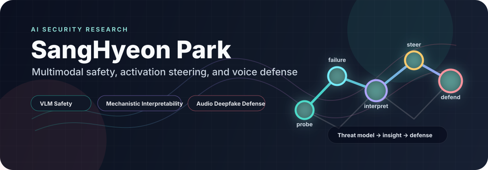
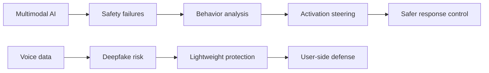

<div align="center">

  

  <h1>SangHyeon Park</h1>
  <p>
    <strong>Cyber Security undergraduate at Ajou University, Republic of Korea</strong><br>
    I study how AI systems fail, why they fail, and how to make them safer before those failures become security problems.
  </p>

<p>
  
  
  
  
</p>

</div>

---

## Research Compass

My work sits at the intersection of **AI safety**, **cyber security**, and **model behavior analysis**. I am especially interested in multimodal systems, where language, vision, and audio create new attack surfaces that traditional security tools do not fully explain.

| Question I care about | Current direction | Output |
| --- | --- | --- |
| When does a vision-language model become unsafe? | VLM safety, refusal behavior, harmful response control | **VLM-CAST** |
| Can internal model behavior be steered without heavy retraining? | Conditional activation steering, representation-level intervention | Safer response mechanisms |
| How can people protect their voice from generative misuse? | Lightweight protection against deepfake audio generation | **VXShield** |
| What makes a model's decision understandable enough to secure? | Mechanistic interpretability for safety-critical behavior | Research notes and experiments |

## Featured Work

| Project | Status | Focus |
| --- | --- | --- |
| **VLM-CAST** | Private, coming soon | Conditional Activation Steering for safe responses in vision-language models |
| **VXShield** | Opened recently | Lightweight voice protection against deepfake audio generation |

## Background

```text
Ajou University                 Cyber Security undergraduate
KITRI Best of the Best 11th     Security Consulting trainee
Whois, Ajou Univ.               President, Vice President, Secretary
Research                        Undergraduate student researcher, 2023 and 2026-present
Republic of Korea Army          Military service
```

## How I Work

- I prefer security questions that can be tested, attacked, and measured.
- I like research that moves from a failure case to a working defense.
- I care about model internals, not only surface-level prompts and outputs.
- I am building toward AI security systems that are practical enough to deploy and rigorous enough to trust.

## Current Focus



## Connect

<p>
  <a href="https://github.com/chipkkang9">
    
  </a>
</p>

Notion: This page was written with CodeX.